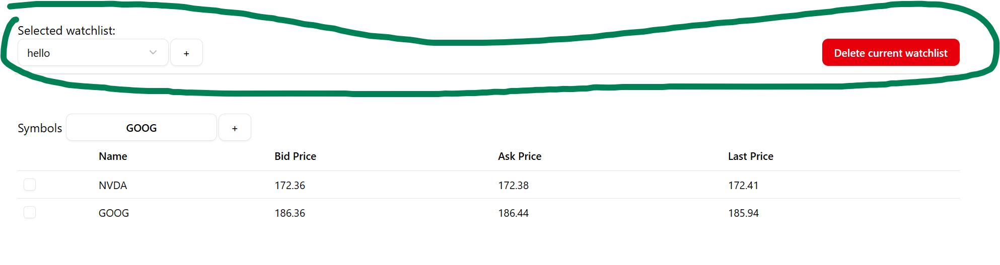
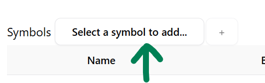
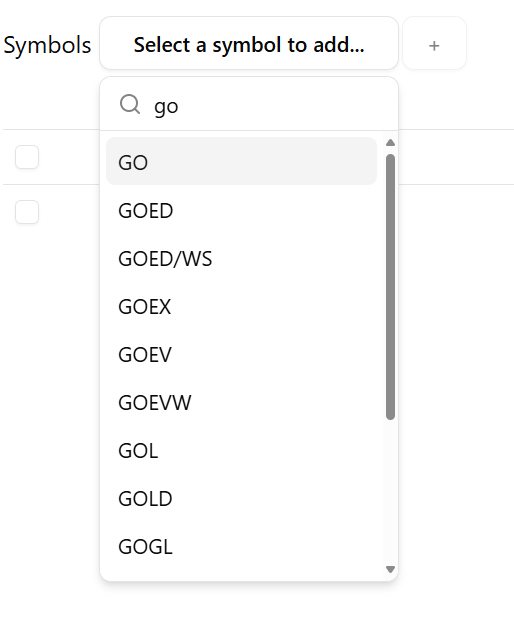
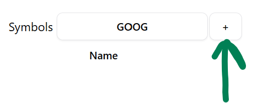
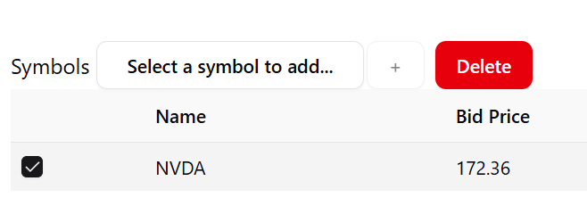

# Tasty Trade Take Home Assessment 
This repo contains my (Michael Rechenberg's) submission for the tastytrade SWE take-home assessment.

The code is within the tasty-trade-assessment/ folder

# Setup and running the application

For running the application, I used node version 24.4.1. pnpm is used as the package manager, so install that if you haven't already.

## One-time setup

First, you'll have to navigate to the tasty-trade-assessment/ folder in your shell.

Then, run the following command to install all the dependencies
> pnpm i

## Running the application

Once the dependencies are installed, you can run
> pnpm run dev

This will start a local webserver serving up the application.

Now you can navigate to the application using a web browser by going to the URL http://localhost:5173/

When you first go to the website, you'll have to provide credentials for your sandbox user. After successful authentication, you'll be navigated to the main watchlist page.

The top of the watchlist page allows you to:
- Add new watchlists by clicking the "+" button
- Switch between watchlists using the dropdown
- Delete the currently selected watchlist using the 'Delete current watchlist' button

You can add symbols to the currently selected watchlist by clicking the symbol search button

and then start typing the name of the symbol you want.  Suggestions will be shown based on what you've typed in.

Click the name of the symbol you want, and then the "+" button will be enabled. You can click the "+" button to add that symbol to your watchlist.

You can delete symbols from the currently selected watchlist by selecting the row(s) of the symbol(s) you want to delete, and then clicking the Delete button above the symbols table.

The prices of all the symbols of the currently selected watchlist are refreshed every 5 seconds.

# Open-Source libraries used

## Svelte app framework (sveltekit)

[sveltekit](https://svelte.dev/tutorial/kit/introducing-sveltekit) is used to give a basic project structure to the whole application.

## UI Component Library (shadcn-svelte)
[shadcn-svelte](https://www.shadcn-svelte.com/) is used for basic UI primitives like buttons and dropdowns, as well as for the watchlist table.

Note, that the way shadcn-svelte distributes code is to include the components' code inside the source of the consuming repo. So all the code in these files/filepaths are from shadcn-svelte, not me.
- src/lib/components/ui/*
- src/lib/hooks/*
- src/lib/utils.ts

Components under src/lib/components/ that are under the mrech folder were written by me (Michael Rechenberg).

## Data Fetching (svelte-query)
[svelte-query](https://sveltequery.vercel.app/) is used for making requests to the TastyTrade API, since it provides some convenient methods for querying. 

